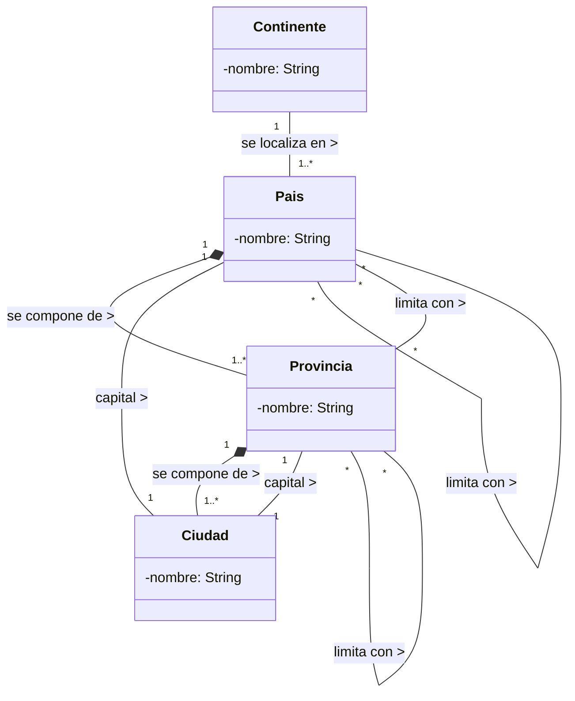

```mermaid
classDiagram
    class Continente {
        -nombre: String
    }
    class Pais {
        -nombre: String
    }
    class Provincia {
        -nombre: String
    }
    class Ciudad {
        -nombre: String
    }

    Continente "1" -- "1..*" Pais : se localiza en >
    Pais "1" *-- "1..*" Provincia : se compone de >
    Pais "1" -- "1" Ciudad : capital >
    Pais "*" -- "*" Pais : limita con >
    
    Provincia "1" *-- "1..*" Ciudad : se compone de >
    Provincia "1" -- "1" Ciudad : capital >
    Provincia "*" -- "*" Provincia : limita con >
    Provincia "*" -- "*" Pais : limita con >
```